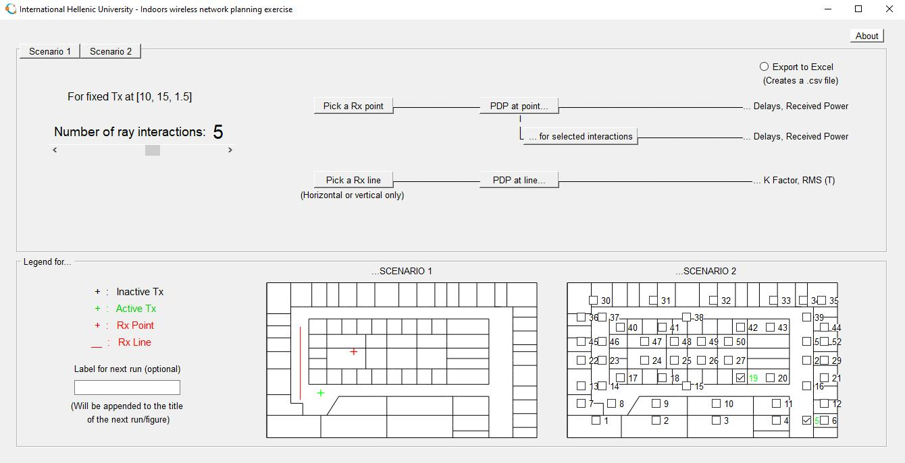
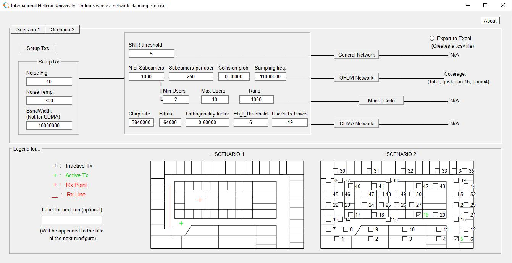
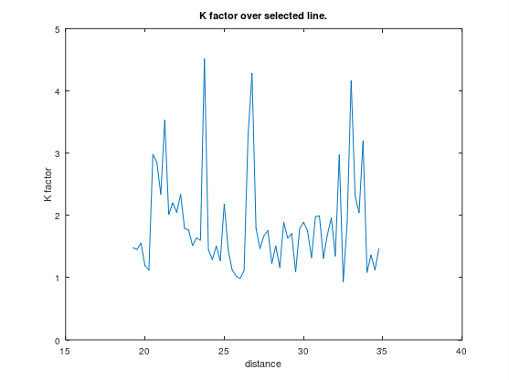
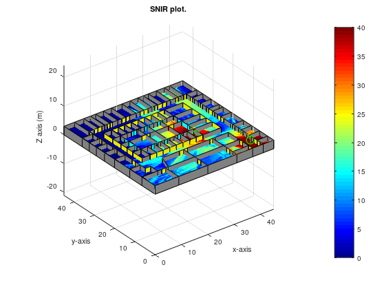
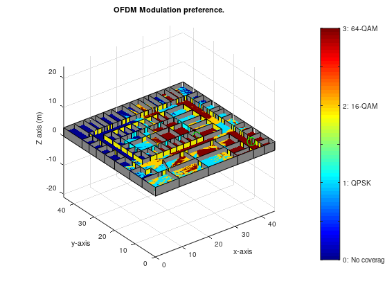

# Wireless Network Simulator

### *University project*
---

## Description

**A ray-tracing simulation of an indoors wireless network with one or more transmitters.**

Field, coverage, modulation and efficiency measurements are taken at specific points,
across user defined lines, or on the whole floor.
These measurements are based on the recreation of realistic phenomena. 

Its purpose is to provide information through various experiments 
with the intention of educating the user about wireless networks.

## How to run:
1. Install Octave
2. Go to the project's home directory
3. Run `main.m`

*If everything works well, a window should pop up.*

## Application

You are presented with two scenarios.

### Scenario 1

Analyze the Packet Data Protocol (PDP) routes and metrics.

Customizable configurations:
* Destination point (Rx Point)
* Destination line (Rx Line)
* Number of ray interactions (bounces)

### Scenario 2

Provides analysis of the following networks
* General
* OFDM
* Monte Carlo 
* CDMA

Selection of up to 50 transmission points.

## Example Outputs

### Scenario 1 - PDP at line

### Scenario 2 - OFDM Network

# Documentation
A detailed explanation of the underlying implementation is available in `Documentation.pdf`.